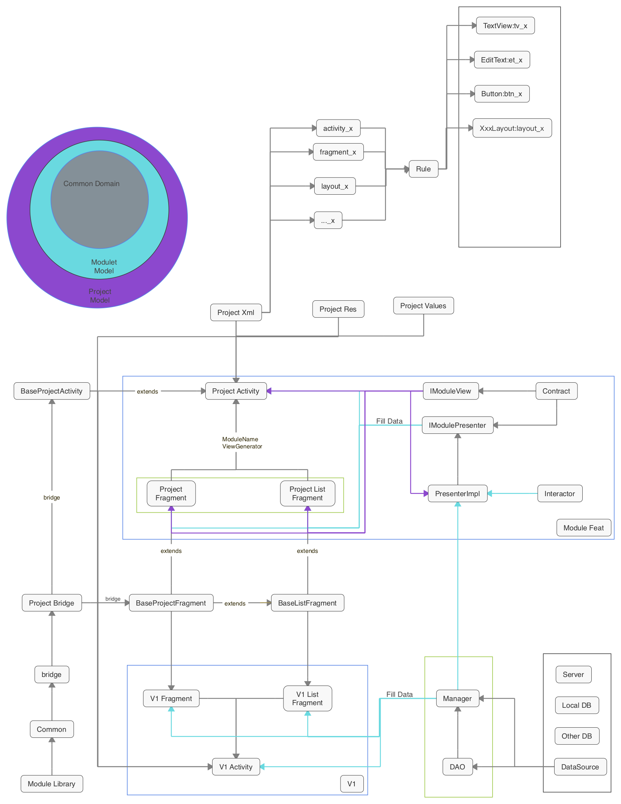

# Android

[  ](https://bintray.com/senrsl/arch/core/_latestVersion)
[  ](https://bintray.com/senrsl/arch/bridge/_latestVersion)
[](https://www.travis-ci.org/senRsl/sample-struct)

## CodeStyle

当前采用格式为 [CandyStyle.xml](doc/CandyStyle.xml)，实际应用中，应基于此模板根据实际情况修改使用。

## VC端通信结构
当前分V1与V2两种方式

其中  
  - V1用于处理简单功能，主要用于无需复用，变化度低模块；  
  - V2主要用于分拆高复杂度模块，实现高复用，适合需求变化快且调用频繁模块；

V1与V2结构区别


其中V1相关结构为

    .
    ├── bridge
    ├── project
    │   ├── activity
    │   ├── adapter
    │   ├── fragment
    │   └── other
    └── other

V2模块结构为

    module
    ├── contract
    │   └── child
    ├── listener
    ├── presenter
    │   └── child
    ├── repository
    └── view
        ├── activity
        ├── adapter
        │   └── child
        ├── component
        │   └── adapter
        └── fragment

具体请参考 [目录结构总纲](doc/structure)


## 布局文件命名

V1版本文件命名遵循原命名方式  
如  
   - [activity_sample.xml](dog/src/main/res/layout/activity_sample.xml)

V2版本文件命名遵循 【文件类型(_功能类型)_模块名】方式

如  
  - [activity_add_dog.xml](dog/src/main/res/layout/activity_add_dog.xml)  
  - [activity_list_dog.xml](dog/src/main/res/layout/activity_list_dog.xml)
  - [activity_detail_dog.xml](dog/src/main/res/layout/activity_detail_dog.xml)
  - [fragment_list_dog.xml](dog/src/main/res/layout/fragment_list_dog.xml)

## 布局控件命名

布局控件采用 【前缀缩写_功能描述(_功能字段)】方式  
如 [layout_rules.xml](dog/src/main/res/layout/layout_rules.xml) 所示

  - layout_rules
  - tv_name
  - et_name


**坑1. 基于此模式，当使用容器控件,如TabLayout时，父控件命名如遵循 layout_tab(_xxx),item布局根控件如是layout类型时遵循layout_item(_xxx)格式**

附 控件缩写前缀表

 控件名称 | 缩写
 ------- | ---
 View | v
 LinearLayout | layout
 RelativeLayout | layout
 TextView | tv
 EditText | et
 RadioButton | rb
 ImageView | iv
 ImageButton | ib
 CheckBox | cb


## 资源命名存放

对于引用资源，如非特殊情况，应统一命名存放  

### 存放   
  - 字符资源 位于 [string.xml](dog/src/main/res/values/strings.xml)
  - 字符数组 位于 [arrays.xml](dog/src/main/res/values/arrays.xml)
  - 图片资源 位于 [drawable-分辨率](app/src/main/res/drawable-hdpi)

### 命名  
资源名称采用 模块名_模块属性(_附加属性)格式，相同模块资源应尽量归类排列，对于可通用资源，采用 功能名(_附加属性) 格式

模块字符资源示例  
```xml
<string name="dog_title_detail">Dog Detail</string>
<string name="dog_from">From:</string>
```

通用字符资源示例  
```xml
<string name="back">返回</string>
<string name="invalid_data">数据无效</string>
```

模块图片资源示例 
[dog_bg.png](dog/src/main/res/drawable-hdpi/dog_bg.png)

## 变量命名基准

控件变量基于 对应控件，采用驼峰命名法命名

如 

控件名称 | 对应变量
--------|-------
layout_rules | layoutRules
tv_name |  tvName
et_name | etName

其中，对于通用字段，代表其所属类为主体的对应字段，应用时应明确此类主体
如
  - id
  - bean
  - adapter
  - listData
  - rvList

对于局部回调方法，应尽量采用变量的方式定义，其格式如下

回调类型 | 命名方式
--------| -------
布局回调 | listenerXxx
业务回调 | cbXxx
vp模式p层回调 | cbLocal(Xxx)

## 方法命名方式

方法命名基准于BaseStruct*类，对于相同功能重写其相应方法

对于ButterKnife的事件类，采用 onView事件(控件)的方式命名  
如  
```java
void onViewClickedContent();
void onViewClickedItem();
boolean onViewLongClickedItem();
```

## 基于BaseStruct*类

基本结构分拆如下

  - 1,static final

- 2,layout res

- 3, 业务 相关变量

- 4, 上层通信

- 5,生命周期  
    父类对生命周期的引申包含在此序列
    
- 6,activity result 操作

- 7,onClick 事件

- 8,本地方法

- 9,view implements

- 9.1 本地view implements

- 9.2 控件view implements

- 9.3 p层 view implements

- 10,view 事件监听，统一为 listenerXxx

- 11,业务层Callback，统一为cbXxx，其中vp通信Xxx为Local(default)或LocalXxx

### Base(Project)Activity extends BaseStructActivity

如无特殊要求，所有Project Activity应继承Base(Project)Activity  
如
  - sample项目中activity继承 [BaseSampleActivity](dog/src/main/java/dc/test/sample/bridge/BaseSampleActivity.java),
  - candy项目中activity继承 [BaseCandyActivity](#)

此类定义该Project的本地化通用实现

方法调用图  
//TODO

调用示例 [DogDetailActivity](dog/src/main/java/dc/test/sample/dog/view/activity/DogDetailActivity.java)

主要方法
```java
void initBindView()；    //绑定布局并调用initOnCreate()
void initOnCreate()；    //调用initLayout()及initData()
void initLayout()；      //用于装载布局
void initData()；        //用于初始化数据
void validData()；       //数据请求前的验证操作
void refreshData()；     //执行数据请求操作
```

### 基于abstract BaseStructFragment

如无特殊要求，所有Project Fragment应基于Base(Struct)Fragment

方法调用图  
//TODO

主要方法

```java
void inflatView();              //复写此类装载布局
void initData()；               //同Activity方法
void loadData();                //包含全局等待框的请求数据 //TODO
void refreshDataOnCreated();    //请求数据在ActivityOnCreated()
void refreshDataOnVisible();    //请求数据在界面展示时
void refreshDataOnRequest();    //请求数据在手动调用时
void refreshData();             //同Activity方法
```
#### 基于 Base(Project)Fragment extends BaseFragment

此类为BaseFragment的本地化实现，如无特殊需求，所有非List的Project Fragment应继承此类

方法调用图  
//TODO

#### 基于 BaseListFragment

当布局需要展示列表时，可根据实际情况继承此类

调用示例 [DogListFragment](dog/src/main/java/dc/test/sample/dog/view/fragment/DogListFragment.java)


#### 基于 BaseListWrapperFragment

使用wrapper方式增加头尾

调用示例 [GroupListFragment](app/src/main/java/dc/test/candy/group/view/fragment/GroupListFragment.java)

### PurposeRecyclerAdapter 通用的RecyclerAdapter

[PurposeRecyclerAdapter](bridge/src/main/java/dc/test/bridge/adapter/PurposeRecyclerAdapter.java) 为 通用Adapter，
示例如 [DogListViewHolder](dog/src/main/java/dc/test/sample/dog/view/adapter/DogListViewHolder.java)

对于无法使用通用adapter适配的列表，可参考 [DogListAdapter](dog/src/main/java/dc/test/sample/dog/view/adapter/DogListAdapter.java)


## V层唤起

### 调起Activity

当使用startActivity()方式启动Activity时，应采用starter方式

调用示例 [DogDetailActivity](dog/src/main/java/dc/test/sample/dog/view/activity/DogDetailActivity.java)

### 调起 Fragment

V1模式调起示例 [FrameViewGenerator.java](app/src/main/java/dc/test/candy/fragment/FrameViewGenerator.java)  
V2模式调起示例 [DogViewGenerator](dog/src/main/java/dc/test/sample/dog/view/DogViewGenerator.java)


## 模块列表

考虑业务需求，基于V1/V2变动，对部分功能分拆模块
